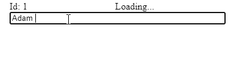
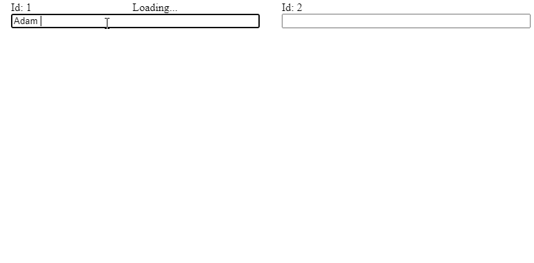
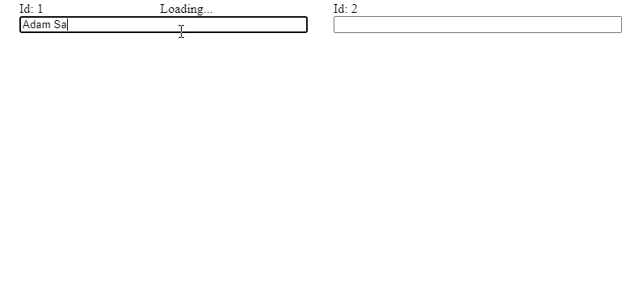

# redux-saga-take-latest

Variation of takeLatest [redux-saga](https://redux-saga.js.org/) effect, allowing to take latest action by specified key.

## Usage

```js
import takeLatestBy from 'redux-saga-take-latest-by';

yield takeLatestBy(
  FETCH_FROM_COLLECTION,
  fetchFromCollection,
  action => action.collectionId
)
```

## Motivation

### Intro

Suppose you want to fetch data from your API. Data is stored in collections, by collection id. This might be your state:

```js
{
  'collection1': {
    loading: false,
    data: [/*some array*/]
  },
  'collection2': {
    loading: false,
    data: [/*some array*/]
  }
}
```

### Problem

You may have want to load the data, filtered by the search term, entered by input. If you use `takeEvery` effect, you may encounter race condition issue. Take a look:

- user types `Adam`
- we start loading data for the term `Adam`, but user then types full name: `Adam Sandler`
- if, by any chance, previous request ends up being handled longer, we might receive data for `Adam` after data for `Adam Sandler`. If we don't save last search term in state, and validate it after data is received, we might overwrite the data for `Adam Sandler` by the `Adam` data.

Here's the demo (also see [sandbox](https://codesandbox.io/s/take-latest-by-problem-md5mo?file=/saga.js)):



### How can we fix it?

- `debounce` the search input. It can help with most cases, but we still might get into trouble if previous requests take longer then timeout passed to `debounce`
- update search term in collection state, and validate if it matches the term inside the action that is dispatched with received data. That solution is correct, but also requires maintenance and is prone to bugs.
- Change `takeEvery` to `takeLatest`. If we have only one collection, that's perfectly fine solution. However, if we have two, like in our case, we will end up cancelling the workers for `collection1` by workers for `collection2`.
  Here's the problem with takeLatest: ([sandbox](https://codesandbox.io/s/take-latest-by-problem-take-latest-e4s6r?file=/saga.js))



### takeLatestBy

This package tries to solve the issue by providing `takeLatestBy` effect. It works similar to `takeLatest`, in a sense that it will cancel previous task if it's already running. Difference is, we are grouping task by key that we provide. So when defined like that:

```js
import takeLatestBy from 'redux-saga-take-latest-by';

yield takeLatestBy(
  FETCH_FROM_COLLECTION,
  fetchFromCollection,
  action => action.collectionId
)
```

It makes sure that we are running only one fetch task per collection id.

Take a look at the demo: ([sandbox](https://codesandbox.io/s/take-latest-by-solution-t88fh?file=/saga.js))


